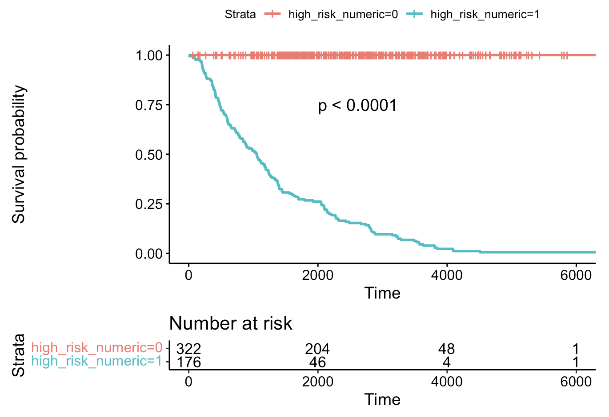

\
  
### Análise prognóstica de pacientes oncológicos

\

Tumores adultos e pediátricos não apresentam mecanismos iguais de malignidade e progressão. Enquanto há consenso de que progressão tumoral em adultos é conduzida por mutações que acumularam-se durante a vida do paciente, tumores pediátricos são dirigidos por mecanismos diferentes. Em neuroblastoma os diferentes fatores que compõem o prognóstico levam à classificação dos paciente como grupo de alto risco e grupo de baixo risco (*high risk*; *low risk*). A figura abaixo mostra a análise de sobrevivência comparando o grupo de risco alto e baixo em neuroblastoma.

\

{width=80%}

\

### Epigenética de cânceres pediátricos

\

Dentre os fatores importantes para o desenvolvimento de tumores em crianças, foi proposto que a epigenética, mais que as mutações genéticas somáticas (de tumores em adultos), contribui com os mecanismos de agressividade tumoral e progressão de cânceres pediátricos. Modificações epigenéticas são modificações quimicamente adicionadas ao nucleotídeo de DNA, como a metilação, que não afetam a sequência de DNA em si, em contraste com as mutações genéticas dos tumores adultos. O grupo de pesquisa ao qual está ligado o Dr. Gepoliano Chaves, na Universidade de Chicago, desenvolveu e patenteou um método para identificação de perfis epigenéticos de 5-hmC em neuroblastoma, um câncer pediátrico do sistema nervoso periférico. Trata-se do marcador 5-hidroxi-metil-citosina (5-hmC), que pode ser isolado a partir de DNA circulante no sangue de crianças portadoras ou sob investigação de serem acometidas pelo neuroblastoma.

\

{width=60%}

\

### PmD para a educação, CT&I e genômica brasileiras

\

A natureza do trabalho desenvolvido por pesquisadores e profissionais das ciências ômicas envolve o componente computacional. A interação entre pesquisadores e o desenvolvimento de algoritmos computacionais para investigação da atividade dos biomarcadores são procedimentos feitos remotamente. Pesquisadores das ciências ômicas utilizam a computação em nuvem e computação quântica para criar e entregar serviços como oportunidades na pesquisa à distância.

\

{width=50%}

\

### Integração da pesquisa ômica ao sistema público de saúde brasileiro (SUS)

\

Visando integrar dados genômicos a dados disponibilizados publicamente pelo sistema público de saúde brasileiro (SUS), revisamos a literatura e escrevemos notebooks explicando e exemplificando a linguagem computacional para fazer a análise genética e genômica que permitirão uma integração da genética e genômica da população brasileira ao Sistema Único de Saúde do país.

\

* [Artigos](artigos.html)
* [Código](codigo.html)